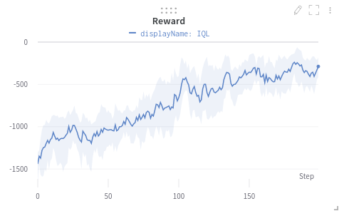
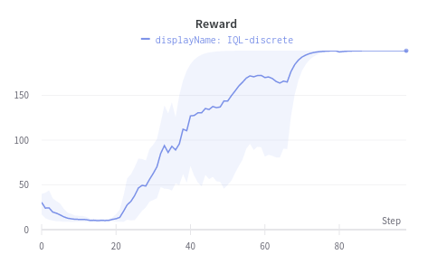

# Implicit-Q-Learning (IQL)
PyTorch implementation of the implicit Q-learning algorithm IQL ([Paper](https://arxiv.org/pdf/2110.06169.pdf))

Currently only implemented for online learning. Offline RL version with D4RL will be updated soon.

# Run

`python train.py`

# Results 
## Continuous IQL
### Pendulum 



## Discrete IQL
### CartPole



# Reference

Original JAX implementation: [IQL](https://github.com/ikostrikov/implicit_q_learning)

## Help and issues:
Im open for feedback, found bugs, improvements or anything. Just leave me a message or contact me.


## Author
- Sebastian Dittert

**Feel free to use this code for your own projects or research.**
```
@misc{IQL,
  author = {Dittert, Sebastian},
  title = {PyTorch Implementation of Implicit-Q-Learning (IQL)},
  year = {2021},
  publisher = {GitHub},
  journal = {GitHub repository},
  howpublished = {\url{https://github.com/BY571/Implicit-Q-Learning}},
}
```
